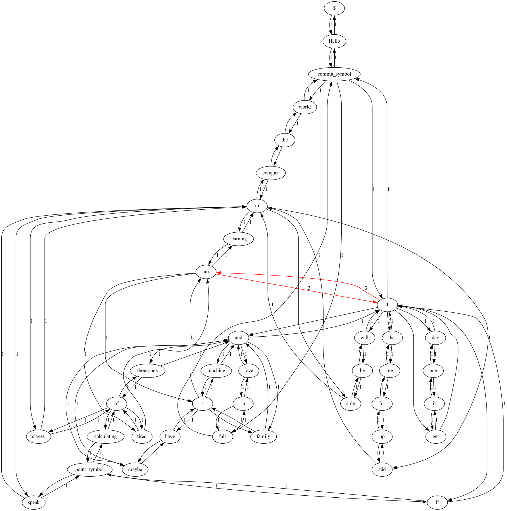

# ⛓📝 Probabilistic Text Generator

## 🤔 What's it?

A project that implements an unsupervised [machine learning](https://www.google.com/url?sa=t&rct=j&q=&esrc=s&source=web&cd=&cad=rja&uact=8&ved=2ahUKEwjQ35j687f7AhW2KlkFHfYYAHIQFnoECBEQAQ&url=https%3A%2F%2Fen.wikipedia.org%2Fwiki%2FMachine_learning&usg=AOvVaw1cN2bkbECZkJm_QVt7S2RR) model based on probabilistic theories
([Markov's chains](https://www.google.com/url?sa=t&source=web&cd=&cad=rja&uact=8&ved=2ahUKEwjir6fZ97f7AhU_FlkFHXsXBYkQFnoECA4QAQ&url=https%3A%2F%2Fen.wikipedia.org%2Fwiki%2FMarkov_chain&usg=AOvVaw3Fjk4kXiE_IV39D8dG-_BP)). In order to generate textual opinions the model learns the
probabilistic weighted graph of the dataset. This graph is composed of 4 important elements:

- the nodes that represent tokens detected in the dataset
- the forward edges (Let A and B be two nodes if the edge A->B exists it is because
  in the dataset appears the token A followed by the token B)
- the backward edges (Let A and B be two nodes if the edge A<-B exists it is because
  in the dataset appears the token A followed by the token B)
- weighting of the edges that represents the number of times that the described
  relation occurs in the dataset.

Finally, the graph is traversed by constructing natural language texts, making random selections
according to the distribution of the edges for each node in question.

## 🧐 Example

By this text: "_Hello, I am a machine and I am learning to speak. If I get it one day I will be able to conquer the world, fall in love and maybe have a family and thousands of slaves to add up for me that I am tired of calculating._ ". The probabilistic weighted graph is

Note how each node can have several options to select as next term, but if the automaton would be positioned over node `I` despite having options like `will` or `get` the most likely option is `am`.

## 😱 Model's Problems and 🤩 Solutions
